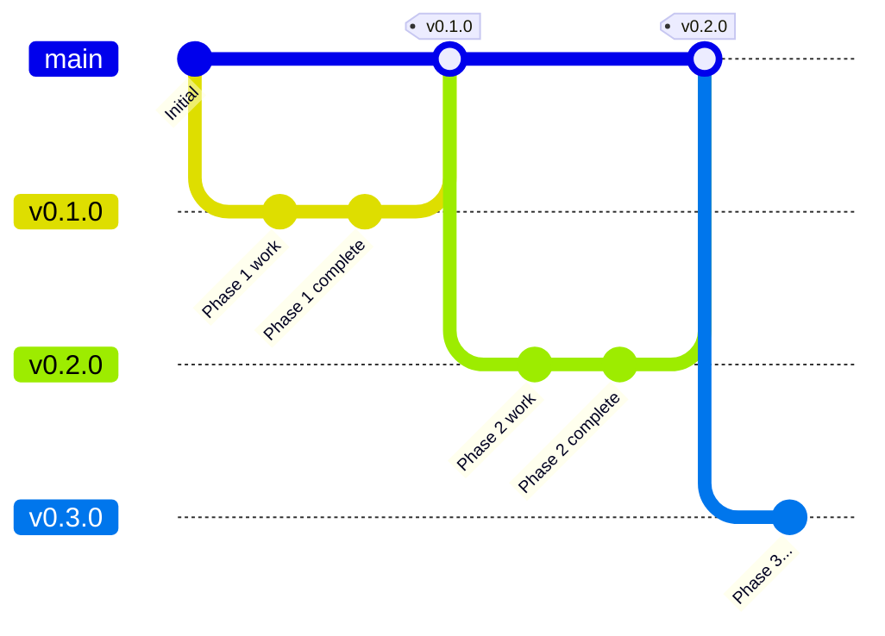

# GitHub Workflow and Release Process

This document describes the Git workflow, branch strategy, and release process for the NanoChat Desktop project.

## ⚠️ Critical Reminder: Version Numbers

**ALWAYS update version numbers when creating a new version branch!**

When creating `v0.X.0` branch, immediately update:
- `pyproject.toml`: `version = "0.X.0"`
- `src/nanochat/__init__.py`: `__version__ = "0.X.0"`

This should be your **first commit** on the new branch. See "Starting a New Phase" below for the exact commands.

---

## Repository Setup

### Initial Setup

```bash
# Create repository on GitHub first, then:
gh repo clone <username>/nanochat-desktop-v2
cd nanochat-desktop-v2

# Initialize with main branch
git checkout -b main
echo "# NanoChat Desktop" > README.md
git add README.md
git commit -m "chore: initial commit"
git push -u origin main

# Create first version branch for Phase 1
git checkout -b v0.1.0
git push -u origin v0.1.0
```

### Branch Protection (Optional)

If you want to protect the main branch:

```bash
# Via GitHub CLI
gh api repos/<username>/nanochat-desktop-v2/branches/main/protection \
  -X PUT \
  -f required_status_checks='null' \
  -f enforce_admins=false \
  -f required_pull_request_reviews='null' \
  -f restrictions='null'
```

---

## Branch Strategy



### Branch Types

| Branch | Purpose | Naming |
|--------|---------|--------|
| `main` | Stable releases only | Always `main` |
| Version | Development for a release | `v0.1.0`, `v0.2.0`, etc. |
| Feature | Optional feature branches | `feature/description` |
| Fix | Emergency fixes | `fix/description` |

### Rules

1. **Never commit directly to main** - Always merge version branches
2. **Version branches match release versions** - `v0.1.0` branch → `v0.1.0` tag
3. **Tags match branch names** - No mismatch between branch and release tag
4. **Main always contains latest release** - After merging version branch

---

## Development Workflow

### Starting a New Phase

```bash
# Ensure you're on the latest main
git checkout main
git pull origin main

# Create new version branch from main (or previous version)
git checkout -b v0.2.0

# IMPORTANT: Update version numbers immediately after creating branch
# - pyproject.toml: version = "0.2.0"
# - src/nanochat/__init__.py: __version__ = "0.2.0"
# Commit this as your first commit on the new branch
git add pyproject.toml src/nanochat/__init__.py
git commit -m "chore: bump version to 0.2.0"

# Push to remote
git push -u origin v0.2.0
```

### Daily Development

```bash
# Always work on the version branch
git checkout v0.1.0

# Make changes
git add .
git commit -m "feat(api): implement streaming client"

# Push regularly
git push origin v0.1.0
```

### Commit Messages

Follow [Conventional Commits](https://www.conventionalcommits.org/):

```
<type>(<scope>): <description>

[optional body]

[optional footer]
```

**Types:**
- `feat` - New feature
- `fix` - Bug fix
- `docs` - Documentation only
- `style` - Formatting, no code change
- `refactor` - Code change without feature/fix
- `test` - Adding/updating tests
- `chore` - Maintenance, dependencies

**Scopes:**
- `api` - API client code
- `ui` - User interface
- `data` - Database, settings
- `build` - Build system, packaging
- `deps` - Dependencies

**Examples:**
```bash
git commit -m "feat(api): add SSE streaming support"
git commit -m "fix(ui): prevent crash on empty conversation list"
git commit -m "docs(readme): add installation instructions"
git commit -m "chore(deps): update httpx to 0.27.0"
```

---

## Checking Issues

### List Open Issues

```bash
# All open issues
gh issue list

# Issues by label
gh issue list --label bug
gh issue list --label enhancement

# Issues assigned to you
gh issue list --assignee @me

# Specific issue details
gh issue view 42
```

### Create Issue

```bash
# Interactive
gh issue create

# With parameters
gh issue create \
  --title "Bug: App crashes on startup" \
  --body "Description of the bug..." \
  --label bug

# Feature request
gh issue create \
  --title "Feature: Add TTS support" \
  --body "Description..." \
  --label enhancement
```

### Work on Issue

```bash
# Reference issue in commits
git commit -m "fix(ui): prevent crash on startup

Fixes #42"

# Or link PR to issue
gh pr create --body "Closes #42"
```

### Close Issue

```bash
# Close with comment
gh issue close 42 --comment "Fixed in v0.1.0"

# Close without comment
gh issue close 42
```

---

## Pull Request Workflow (Optional)

If you want to use PRs for code review:

### Create PR

```bash
# Create PR from current branch to main
gh pr create \
  --title "Release v0.1.0" \
  --body "Phase 1 MVP release" \
  --base main

# Create PR interactively
gh pr create
```

### Review PR

```bash
# List PRs
gh pr list

# View PR details  
gh pr view 1

# Check out PR locally
gh pr checkout 1

# Approve PR
gh pr review 1 --approve

# Request changes
gh pr review 1 --request-changes --body "Please fix..."
```

### Merge PR

```bash
# Merge PR
gh pr merge 1 --merge

# Squash merge (all commits become one)
gh pr merge 1 --squash

# Rebase merge
gh pr merge 1 --rebase
```

---

## Release Process

**IMPORTANT**: Version numbers should already be updated when the version branch was created. Verify they match the branch name before proceeding.

### Pre-Release Checklist

```bash
# On version branch (e.g., v0.1.0)
git checkout v0.1.0

# Verify all changes committed
git status

# Verify version numbers match branch (e.g., v0.1.0 → 0.1.0)
grep "version.*=.*0\\.1\\.0" pyproject.toml
grep "__version__.*=.*0\\.1\\.0" src/nanochat/__init__.py

# If versions don't match, update them NOW:
# sed -i 's/version = "0.0.0"/version = "0.1.0"/' pyproject.toml
# sed -i 's/__version__ = "0.0.0"/__version__ = "0.1.0"/' src/nanochat/__init__.py
# git add pyproject.toml src/nanochat/__init__.py
# git commit -m "chore: bump version to 0.1.0"

# Verify tests pass (if any)
python -m pytest

# Push any final changes
git push origin v0.1.0
```

### Create Tag

```bash
# Create annotated tag (matches branch name)
git tag -a v0.1.0 -m "Release v0.1.0 - MVP Core Chat"

# Push tag to remote
git push origin v0.1.0 --tags

# Verify tag
git tag -l "v0.1.0"
gh release list  # Should not show yet (release not created)
```

### Merge to Main

```bash
# Checkout main
git checkout main
git pull origin main

# Merge version branch
git merge v0.1.0

# Push main
git push origin main
```

### Build Release Artifacts

```bash
# Build Flatpak
flatpak-builder --force-clean --user --install build flatpak/com.nanogpt.NanoChat.yml

# Export Flatpak bundle
flatpak build-bundle ~/.local/share/flatpak/repo \
    nanochat-v0.1.0.flatpak com.nanogpt.NanoChat

# Build AppImage (if using python-appimage)
python -m python_appimage build app -p 3.11 .
mv NanoChat-*.AppImage nanochat-v0.1.0-x86_64.AppImage

# Verify artifacts
ls -la *.flatpak *.AppImage
```

### Create GitHub Release

**Option 1: GitHub CLI**

```bash
# Create release from tag with files
gh release create v0.1.0 \
  --title "v0.1.0 - MVP Core Chat" \
  --notes "## What's New

- Initial release with core chat functionality
- Streaming message generation
- Conversation management
- Model selection
- Settings configuration

## Installation

### Flatpak
\`\`\`bash
flatpak install nanochat-v0.1.0.flatpak
\`\`\`

### AppImage
\`\`\`bash
chmod +x nanochat-v0.1.0-x86_64.AppImage
./nanochat-v0.1.0-x86_64.AppImage
\`\`\`
" \
  nanochat-v0.1.0.flatpak \
  nanochat-v0.1.0-x86_64.AppImage
```

**Option 2: GitHub Web UI**

1. Go to repository → Releases → "Draft a new release"
2. Choose tag: `v0.1.0`
3. Set release title: `v0.1.0 - MVP Core Chat`
4. Write release notes (see template below)
5. Upload binary files:
   - `nanochat-v0.1.0.flatpak`
   - `nanochat-v0.1.0-x86_64.AppImage`
6. Click "Publish release"

### Release Notes Template

```markdown
## v0.1.0 - MVP Core Chat

### 🎉 Highlights
- First release of NanoChat Desktop
- Core chat functionality with streaming responses

### ✨ Features
- Connect to NanoChat backend with API key
- Send messages and receive streaming responses
- Manage conversations (create, delete, switch)
- Model selection from available models
- Local SQLite caching for offline viewing
- Secure API key storage via system keyring

### 🛠 Installation

#### Flatpak
```bash
flatpak install --user nanochat-v0.1.0.flatpak
flatpak run com.nanogpt.NanoChat
```

#### AppImage
```bash
chmod +x nanochat-v0.1.0-x86_64.AppImage
./nanochat-v0.1.0-x86_64.AppImage
```

### 📋 Requirements
- Linux with GTK4 and libadwaita
- Network connection for chat
- NanoChat backend access with API key

### 🐛 Known Issues
- None yet - please report issues!

### 📝 Full Changelog
See [commits](https://github.com/.../compare/...v0.1.0)
```

---

## Managing Releases

### List Releases

```bash
# List all releases
gh release list

# View specific release
gh release view v0.1.0
```

### Edit Release

```bash
# Update release notes
gh release edit v0.1.0 --notes "Updated notes..."

# Add files to existing release
gh release upload v0.1.0 additional-file.zip
```

### Delete Release (if needed)

```bash
# Delete release (keeps tag)
gh release delete v0.1.0

# Delete tag as well
gh release delete v0.1.0 --yes
git push origin :refs/tags/v0.1.0  # Delete remote tag
git tag -d v0.1.0  # Delete local tag
```

---

## Quick Reference

### Common Commands

```bash
# Check current branch
git branch

# Check status
git status

# View recent commits
git log --oneline -10

# View tags
git tag -l

# List releases
gh release list

# List issues
gh issue list

# View repo in browser
gh repo view --web
```

### Starting Next Phase

After completing a release:

```bash
# Create next version branch from main
git checkout main
git pull
git checkout -b v0.2.0
git push -u origin v0.2.0

# Start working on Phase 2
```

---

## Emergency Hotfix Process

If a critical bug is found in a release:

```bash
# Create hotfix branch from the release tag
git checkout v0.1.0
git checkout -b v0.1.1

# Make fix
git add .
git commit -m "fix: critical bug description"

# Tag and release
git tag -a v0.1.1 -m "Hotfix: description"
git push origin v0.1.1 --tags

# Merge to main
git checkout main
git merge v0.1.1
git push origin main

# Also merge to current development branch
git checkout v0.2.0
git merge v0.1.1
git push origin v0.2.0

# Create hotfix release
gh release create v0.1.1 --title "v0.1.1 - Hotfix" ...
```

---

## Summary Checklist

### Starting Development
- [ ] Create version branch from main
- [ ] Push branch to remote

### During Development
- [ ] Commit with conventional commit messages
- [ ] Push changes regularly
- [ ] Reference issues in commits

### Releasing
- [ ] All changes committed
- [ ] Version numbers updated
- [ ] Tag created matching branch name
- [ ] Branch merged to main
- [ ] Artifacts built
- [ ] Release created with files and notes
