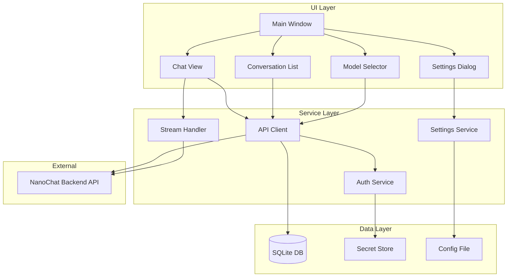

# NanoChat Desktop - Linux Development Plan

## Executive Summary

This document outlines the development plan for converting the NanoChat Android application into a native Linux desktop application using Python and GTK4. The plan follows an MVP-first approach, starting with core chat functionality and roadmapping additional features for future phases.

---

## Tech Stack Recommendation

### Primary Stack: Python + GTK4

| Component | Technology | Rationale |
|-----------|------------|-----------|
| **Language** | Python 3.11+ | Rapid development, excellent async support, rich ecosystem |
| **UI Framework** | GTK4 via PyGObject | Native Linux feel, modern design, Libadwaita integration |
| **HTTP Client** | `httpx` | Async support, HTTP/2, SSE streaming |
| **Database** | SQLite via `sqlite3` | Local caching, same as Android Room backend |
| **JSON Handling** | `pydantic` v2 | Type safety, validation, JSON serialization |
| **Configuration** | XDG Base Directory | `~/.config/nanochat/` following Linux standards |
| **Secrets** | `libsecret` | KDE Wallet/GNOME Keyring integration |
| **Packaging** | Flatpak, AppImage | Cross-distro distribution |

### Alternative: Python + PyQt6

If GTK4 proves limiting:

| Aspect | GTK4 | PyQt6 |
|--------|------|-------|
| KDE Integration | Good | Excellent |
| Learning Curve | Moderate | Moderate |
| License | LGPL | GPL/Commercial |
| Modern UI | Libadwaita | QML/Widgets |

**Recommendation**: Start with GTK4 + Libadwaita for modern adaptive design. Switch to Qt if KDE-specific features become critical.

---

## API Analysis Summary

Based on analysis of the Android codebase, here are the key API endpoints:

### Authentication
- Uses Bearer token authentication via `Authorization: Bearer <API_KEY>`
- Backend URL is user-configurable
- Token stored securely in encrypted preferences on Android

### Core Endpoints

```
Conversations:
  GET    /api/db/conversations         - List conversations with optional filters
  POST   /api/db/conversations         - Update conversation or set project
  DELETE /api/db/conversations?id=X    - Delete conversation

Messages:
  GET    /api/db/messages?conversationId=X  - Get messages for conversation
  POST   /api/generate-message              - Generate message via streaming

Models:
  GET    /api/models                   - List available models
  GET    /api/model-providers?modelId=X - Get providers for a model

Assistants:
  GET    /api/assistants               - List assistants
  POST   /api/assistants               - Create assistant
  PATCH  /api/assistants/:id           - Update assistant
  DELETE /api/assistants/:id           - Delete assistant

Projects:
  GET    /api/projects                 - List projects
  POST   /api/projects                 - Create project
  GET    /api/projects/:id             - Get project
  PATCH  /api/projects/:id             - Update project
  DELETE /api/projects/:id             - Delete project

Settings:
  GET    /api/db/user-settings         - Get user settings
  POST   /api/db/user-settings         - Update settings

Balance:
  POST   /api/nano-gpt/balance         - Get NanoGPT balance
  GET    /api/nano-gpt/subscription-usage - Get subscription usage
```

### Streaming Protocol

Message generation uses Server-Sent Events (SSE):

```
POST /api/generate-message
Accept: text/event-stream

Request Body:
{
  "message": "Hello",
  "model_id": "gpt-4",
  "conversation_id": "optional-uuid",
  "assistant_id": "optional-uuid",
  "web_search_enabled": false
}

SSE Events:
  data: {"token": "streaming text"}
  data: {"content": "full content delta"}
  data: {"reasoning": "reasoning content"}
  data: {"conversationId": "uuid", "conversationTitle": "New Chat"}
  data: [DONE]
```

---

## MVP Feature Set - Phase 1

### Core Features

1. **Setup/Login Screen**
   - Backend URL configuration
   - API key input with secure storage
   - Connection validation

2. **Chat View**
   - Message input with send button
   - Streaming response display
   - Markdown rendering for responses
   - Model selector dropdown
   - Stop generation button

3. **Conversations Sidebar**
   - List recent conversations
   - Create new conversation
   - Delete conversation
   - Switch between conversations

4. **Local Storage**
   - Cache conversations locally in SQLite
   - Store settings in `~/.config/nanochat/`
   - Secure API key storage via libsecret

### UI Layout - MVP

```
┌────────────────────────────────────────────────────────────┐
│  NanoChat                                    [Model ▼]  ⚙  │
├──────────────┬─────────────────────────────────────────────┤
│              │                                             │
│ Conversations│           Chat Messages Area                │
│              │                                             │
│ + New Chat   │  ┌─────────────────────────────────────┐   │
│              │  │ User: Hello                         │   │
│ □ Chat 1     │  └─────────────────────────────────────┘   │
│ □ Chat 2     │  ┌─────────────────────────────────────┐   │
│ □ Chat 3     │  │ Assistant: Hi! How can I help?      │   │
│              │  └─────────────────────────────────────┘   │
│              │                                             │
│              ├─────────────────────────────────────────────┤
│              │ [Type a message...                ] [Send]  │
└──────────────┴─────────────────────────────────────────────┘
```

---

## Architecture Design



---

## Project Structure

```
nanochat-desktop/
├── pyproject.toml              # Project configuration and dependencies
├── README.md
├── LICENSE
├── meson.build                 # Build system for Flatpak/packaging
│
├── src/
│   ├── __init__.py
│   ├── main.py                 # Application entry point
│   │
│   ├── api/                    # API service layer
│   │   ├── __init__.py
│   │   ├── client.py           # HTTP client wrapper
│   │   ├── streaming.py        # SSE stream handler
│   │   ├── models.py           # Pydantic models for DTOs
│   │   └── endpoints.py        # API endpoint definitions
│   │
│   ├── data/                   # Data persistence layer
│   │   ├── __init__.py
│   │   ├── database.py         # SQLite operations
│   │   ├── models.py           # Database models
│   │   ├── settings.py         # Settings management
│   │   └── secrets.py          # Secure credential storage
│   │
│   ├── ui/                     # GTK4 UI components
│   │   ├── __init__.py
│   │   ├── window.py           # Main application window
│   │   ├── chat_view.py        # Chat message area
│   │   ├── message_widget.py   # Individual message display
│   │   ├── conversation_row.py # Sidebar conversation item
│   │   ├── model_selector.py   # Model dropdown
│   │   └── setup_dialog.py     # Initial setup wizard
│   │
│   └── utils/                  # Utility functions
│       ├── __init__.py
│       ├── markdown.py         # Markdown to Pango conversion
│       └── xdg.py              # XDG directory helpers
│
├── data/                       # Static resources
│   ├── icons/
│   │   └── nanochat.svg
│   ├── styles/
│   │   └── style.css
│   └── com.nanogpt.NanoChat.desktop
│
├── flatpak/                    # Flatpak packaging
│   └── com.nanogpt.NanoChat.yml
│
└── appimage/                   # AppImage packaging
    └── AppImageBuilder.yml
```

---

## Data Models - Pydantic

```python
# src/api/models.py

from pydantic import BaseModel
from datetime import datetime
from typing import Optional

class Conversation:
    id: str
    title: str
    user_id: str
    assistant_id: Optional[str] = None
    project_id: Optional[str] = None
    model_id: Optional[str] = None
    created_at: datetime
    updated_at: datetime
    message_count: int = 0
    pinned: bool = False
    cost_usd: Optional[float] = None

class Message:
    id: str
    conversation_id: str
    role: str  # user | assistant | system
    content: str
    reasoning: Optional[str] = None
    model_id: Optional[str] = None
    created_at: datetime
    token_count: Optional[int] = None
    cost_usd: Optional[float] = None
    starred: Optional[bool] = None

class Model:
    id: str
    name: str
    description: Optional[str] = None
    enabled: bool
    pinned: bool
    capabilities: ModelCapabilities
    pricing: Optional[ModelPricing] = None

class ModelCapabilities:
    vision: bool = False
    reasoning: bool = False
    images: bool = False
    video: bool = False

class GenerateMessageRequest:
    message: Optional[str] = None
    model_id: str
    assistant_id: Optional[str] = None
    project_id: Optional[str] = None
    conversation_id: Optional[str] = None
    web_search_enabled: Optional[bool] = None
```

---

## Development Phases

### Phase 1: MVP - Core Chat - 4-6 weeks
- [ ] Project setup with GTK4 and dependencies
- [ ] API client with httpx async
- [ ] SSE streaming implementation
- [ ] SQLite local database
- [ ] Secure credential storage
- [ ] Main window with chat view
- [ ] Conversation sidebar
- [ ] Model selector
- [ ] Setup/configuration dialog
- [ ] Basic packaging for Flatpak/AppImage

### Phase 2: Enhanced UX - 2-3 weeks  
- [ ] Search conversations
- [ ] Conversation renaming
- [ ] Message editing
- [ ] Copy message content
- [ ] Keyboard shortcuts
- [ ] Dark/light theme support
- [ ] System tray integration

### Phase 3: Assistants and Projects - 2-3 weeks
- [ ] Assistants management
- [ ] Projects management  
- [ ] Move conversations to projects
- [ ] Assistant/project selection in chat

### Phase 4: Advanced Features - 3-4 weeks
- [ ] Web search integration
- [ ] Image attachments
- [ ] Document attachments
- [ ] Starred messages
- [ ] Model performance stats
- [ ] Balance/usage display

### Phase 5: Polish - 2-3 weeks
- [ ] Catppuccin/Tokyo Night themes
- [ ] Responsive/adaptive layout
- [ ] Accessibility improvements
- [ ] Flatpak store submission
- [ ] Documentation

---

## Key Implementation Details

### SSE Streaming with httpx

```python
# src/api/streaming.py

import httpx
from typing import AsyncGenerator, Callable
from dataclasses import dataclass

@dataclass
class StreamEvent:
    type: str  # token, content, reasoning, conversation_created, complete, error
    data: str

async def stream_message(
    base_url: str,
    token: str,
    request: dict
) -> AsyncGenerator[StreamEvent, None]:
    headers = {
        "Authorization": f"Bearer {token}",
        "Accept": "text/event-stream",
        "Content-Type": "application/json"
    }
    
    async with httpx.AsyncClient(timeout=300.0) as client:
        async with client.stream(
            "POST",
            f"{base_url}/api/generate-message",
            headers=headers,
            json=request
        ) as response:
            async for line in response.aiter_lines():
                if line.startswith("data: "):
                    data = line[6:]
                    if data == "[DONE]":
                        yield StreamEvent(type="complete", data="")
                        break
                    # Parse JSON and yield appropriate event
                    ...
```

### GTK4 Async Integration

```python
# Using GLib.idle_add for thread-safe UI updates
import gi
gi.require_version("Gtk", "4.0")
from gi.repository import Gtk, GLib
import asyncio

def run_async(coro):
    """Run async coroutine from GTK callback"""
    asyncio.create_task(coro)

def update_ui_from_thread(callback):
    """Thread-safe UI update"""
    GLib.idle_add(callback)
```

---

## Configuration Storage

Following XDG Base Directory specification:

```
~/.config/nanochat/
├── config.toml          # User preferences
└── nanochat.db          # SQLite database

~/.local/share/nanochat/
└── cache/               # Temporary cache files

API keys stored in:
- GNOME: gnome-keyring via libsecret
- KDE: kwallet via libsecret
- Fallback: encrypted file with user password
```

### config.toml Example

```toml
[server]
backend_url = "https://your-nanochat-server.com"

[ui]
theme = "system"  # system | light | dark
sidebar_width = 280

[chat]
default_model = "gpt-4o"
```

---

## Packaging

### Flatpak Requirements

```yaml
# flatpak/com.nanogpt.NanoChat.yml
app-id: com.nanogpt.NanoChat
runtime: org.gnome.Platform
runtime-version: '46'
sdk: org.gnome.Sdk
command: nanochat

finish-args:
  - --share=network
  - --share=ipc
  - --socket=fallback-x11
  - --socket=wayland
  - --talk-name=org.freedesktop.secrets  # For keyring access

modules:
  - name: nanochat
    buildsystem: simple
    build-commands:
      - pip3 install --prefix=/app .
    sources:
      - type: dir
        path: ..
```

### AppImage Structure

Using `python-appimage` for packaging:
- Bundle Python runtime
- Include all pip dependencies
- Single executable file

---

## Risks and Mitigations

| Risk | Impact | Mitigation |
|------|--------|------------|
| GTK4/async complexity | Medium | Use GLib.idle_add for UI updates |
| SSE handling edge cases | Medium | Port streaming logic from Android |
| Secret storage cross-DE | Low | libsecret provides abstraction |
| Flatpak permissions | Low | Test on fresh install |
| Python startup time | Low | Consider PyPy or lazy imports |

---

## Next Steps

1. **Approve this plan** or request modifications
2. **Create project repository** with basic structure
3. **Implement API client** with connection test
4. **Build basic GTK4 window** with chat layout
5. **Implement streaming** for message generation
6. **Add conversation management** sidebar
7. **Package for testing** on target system

---

## Questions for Consideration

1. Should we support system proxy settings automatically?
2. Should there be an option to export conversations locally?
3. Any specific keyboard shortcuts you want from the start?
4. Do you want the app name to remain "NanoChat" or have a different desktop identity?
